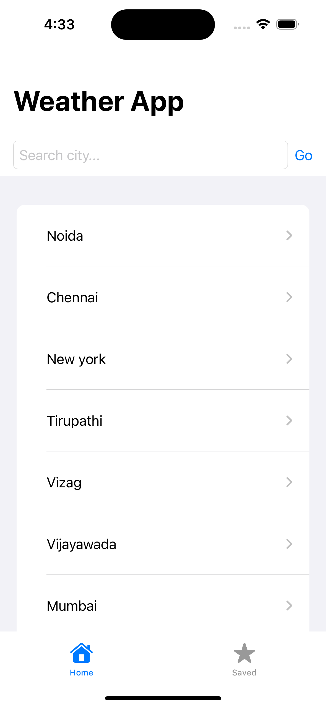
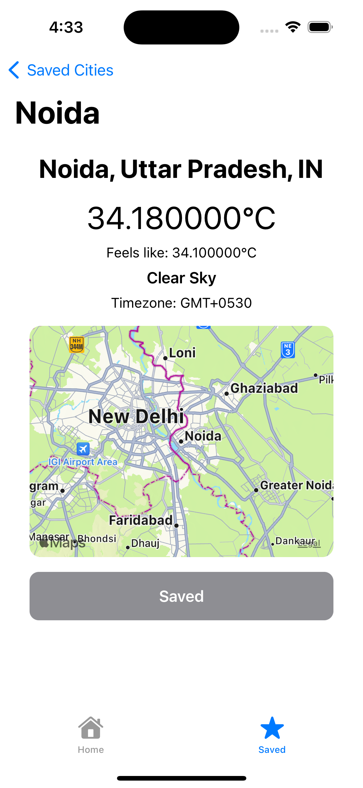

# Quin_Assignment
# 🌤️ SwiftUI Weather App

A sample **iOS app built with SwiftUI + Core Data** that allows users to:

- 🔍 Search for cities  
- 📊 View weather & timezone data (via OpenWeatherMap API)  
- ⭐ Save cities for offline access  
- 🕑 View recent searches (persistent history)  

This project demonstrates **good architecture, offline persistence, error handling, and modern SwiftUI practices**.

---

## ✨ Features

- **Search cities** using OpenWeatherMap Geocoding API  
- **Weather details**: temperature, feels like, description, timezone, map preview  
- **Saved cities**: persistent list using Core Data  
- **Offline mode**: saved cities (and their last known weather) remain available offline  
- **Search history**: recent queries saved locally with duplicate prevention  
- **Error states**: shows loading indicators, retry on failure, handles “No Internet Connection”  

---

## 🛠️ Tech Stack

- **Language**: Swift 5, SwiftUI  
- **Architecture**: MVVM + Repository Pattern  
- **Networking**: `URLSession` (async/await)  
- **Persistence**: Core Data (programmatic model)  
- **Maps**: `Map` (SwiftUI MapKit)  

---

## 📱 Screens

1. **Home Screen** – Search bar + Recent searches  
2. **Search Results** – Cities from API  
3. **City Detail** – Weather, timezone, map, Save button  
4. **Saved Cities** – Persistent offline list  

---

## 🚀 Getting Started

### 1. Clone the repo
```bash
git clone https://github.com/your-username/WeatherApp.git
cd WeatherApp

### 2. Open in Xcode repo

Open WeatherApp.xcodeproj (or .xcworkspace if you added packages).

3. Add your API key

Get a free API key from OpenWeatherMap
.

In APIService.swift, replace:
private let apiKey = "OPENWEATHER_API_KEY"

🗂️ Project Structure
Quin_Assignment/
 ├── Models/
 │    ├── City.swift
 │    └── Weather.swift
 ├── ViewModels/
 │    ├── HomeViewModel.swift
 │    ├── CityDetailViewModel.swift
 │    └── SavedCitiesViewModel.swift
 ├── Views/
 │    ├── HomeView.swift
 │    ├── SearchResultsView.swift
 │    ├── CityDetailView.swift
 │    └── SavedCitiesView.swift
 ├── Persistence/
 │    └── PersistenceController.swift
 │    └── CityRepository.swift
 │    └── SearchHistoryRepository.swift
 ├── Networking/
 │    └── APIService.swift

Quin_Assignment/
 ├── screenshots/
 │     ├── 1.png
 │     ├── 2.png
 │     ├── 3.png
 ├── README.md

## 📱 Screenshots






